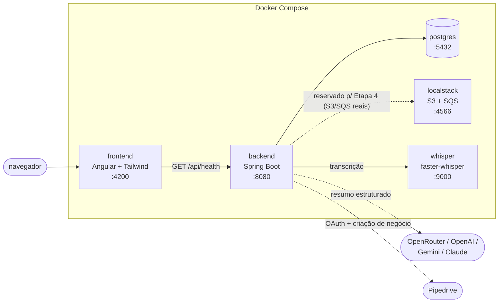

# Meeting AI

SaaS que transcreve reuniões (áudio/vídeo) e atualiza o CRM automaticamente
a partir do resumo gerado, sempre com revisão humana antes do envio. O
pipeline principal (login com Google, upload, transcrição via Whisper,
resumo estruturado via LLM, revisão, envio ao Pipedrive, expiração
automática do áudio) já roda de ponta a ponta contra o ambiente local —
ver [`docs/api-endpoints.md`](docs/api-endpoints.md) para o contrato de
API completo.

O plano de produto completo (etapas futuras: transcrição, resumo via LLM,
integração com CRM, deploy em AWS) está em [`PLAIN.md`](PLAIN.md). As
decisões de arquitetura tomadas ao longo do caminho ficam registradas em
[`docs/decisions/`](docs/decisions/).

## Arquitetura local



O áudio de upload fica em disco local (`StorageService`/`LocalDiskStorageService`),
não no LocalStack — o bucket S3 já existe no ambiente local pra Etapa 4
(deploy), mas a aplicação só passa a usá-lo trocando a implementação por
configuração, sem mudar código (ver
[`docs/decisions/`](docs/decisions/)). Em produção, `postgres` vira RDS,
`localstack` vira S3 + SQS reais, `whisper` vira Amazon Transcribe,
`backend` roda em ECS/Fargate e `frontend` é buildado e servido via S3 +
CloudFront — ver Etapa 4 em [`PLAIN.md`](PLAIN.md).

## Como rodar localmente

Pré-requisitos: Docker e Docker Compose. Nada mais precisa estar instalado
na máquina — Java, Maven, Node e Angular CLI já vêm dentro dos containers.

```bash
cp .env.example .env   # valores padrão já sobem o ambiente
docker compose up
```

Isso sobe 5 serviços, sem nenhum passo manual adicional:

| Serviço    | URL local               | O que é                                   |
|------------|--------------------------|--------------------------------------------|
| `frontend` | http://localhost:4200    | Angular, com live reload                   |
| `backend`  | http://localhost:8080    | Spring Boot, com restart automático (DevTools) |
| `postgres` | localhost:5432            | banco de dados                             |
| `localstack` | http://localhost:4566   | S3 + SQS locais, já com bucket e fila criados (reservado pra Etapa 4) |
| `whisper`  | http://localhost:9000    | transcrição local (faster-whisper), sem custo de AWS |

Abra http://localhost:4200 — a tela inicial mostra se o frontend conseguiu
falar com o `GET /api/health` do backend.

Os defaults do `.env.example` sobem o ambiente e deixam todo o pipeline
compilando/testável, mas algumas features só funcionam de verdade com
credenciais reais (documentadas, sem valor, no próprio `.env.example`):
login exige `GOOGLE_CLIENT_ID`/`GOOGLE_CLIENT_SECRET` de um app OAuth do
Google Cloud Console; resumo via LLM (plano free) exige
`OPENROUTER_API_KEY`; envio ao CRM exige `PIPEDRIVE_CLIENT_ID`/`PIPEDRIVE_CLIENT_SECRET`
de um app Pipedrive. Sem isso, o backend sobe normalmente — só a chamada
externa específica falha com uma mensagem clara.

### Hot-reload

- **Backend**: o código-fonte de `backend/` é montado como volume dentro do
  container. `mvn spring-boot:run` sozinho **não** recompila `.java` ao
  salvar — por isso [`backend/dev-entrypoint.sh`](backend/dev-entrypoint.sh)
  roda, em paralelo, um watcher com `entr` que recompila
  (`mvn compile`) a cada alteração; o Spring Boot DevTools detecta as
  classes recompiladas em `target/classes` e reinicia a aplicação sozinho —
  sem `docker compose build`.
- **Frontend**: o código-fonte de `frontend/` também é montado como volume.
  `ng serve` roda com `--poll` para detectar mudanças mesmo em sistemas de
  arquivos de bind mount do Docker que não propagam eventos `inotify`
  (comum em Docker Desktop no Mac/Windows; no Linux nativo funciona também
  sem polling, mas a flag foi deixada ligada para garantir consistência em
  qualquer máquina).
- `node_modules` (frontend) e o cache do Maven (`~/.m2`, backend) ficam em
  volumes nomeados separados, para não serem sobrescritos pelo bind mount
  do código-fonte e não precisarem ser reinstalados a cada `up`.

### LocalStack

O bucket S3 e a fila SQS usados pelo projeto são criados automaticamente
quando o container do LocalStack sobe, via
[`localstack/init-aws.sh`](localstack/init-aws.sh) — não é preciso nenhum
passo manual depois do `docker compose up`. Para conferir:

```bash
docker compose exec localstack awslocal s3 ls
docker compose exec localstack awslocal sqs list-queues
```

## Estrutura de pastas

```
.
├── backend/            # Spring Boot (Java 25) — API
├── frontend/            # Angular + Tailwind — interface web
├── docs/decisions/      # ADRs — decisões de arquitetura, uma por arquivo
├── localstack/           # script de inicialização do S3/SQS local
├── docker-compose.yml    # sobe o ambiente local completo
├── .env.example          # variáveis de ambiente documentadas (sem segredos)
├── AGENTS.md              # padrão de desenvolvimento para agentes de IA
└── PLAIN.md                # plano de produto completo (todas as etapas)
```

## CI

Dois workflows no GitHub Actions, cada um disparado só quando a pasta
correspondente muda (`paths:` no workflow):

- [`.github/workflows/ci-backend.yml`](.github/workflows/ci-backend.yml) — `mvn test` contra um Postgres de serviço.
- [`.github/workflows/ci-frontend.yml`](.github/workflows/ci-frontend.yml) — `ng lint` + `ng test`.

Os dois já estão estruturados para que um job de `deploy` futuro entre com
`needs: test` — ou seja, deploy nunca dispara sem os testes passarem antes
(ver comentários nos próprios arquivos de workflow).
